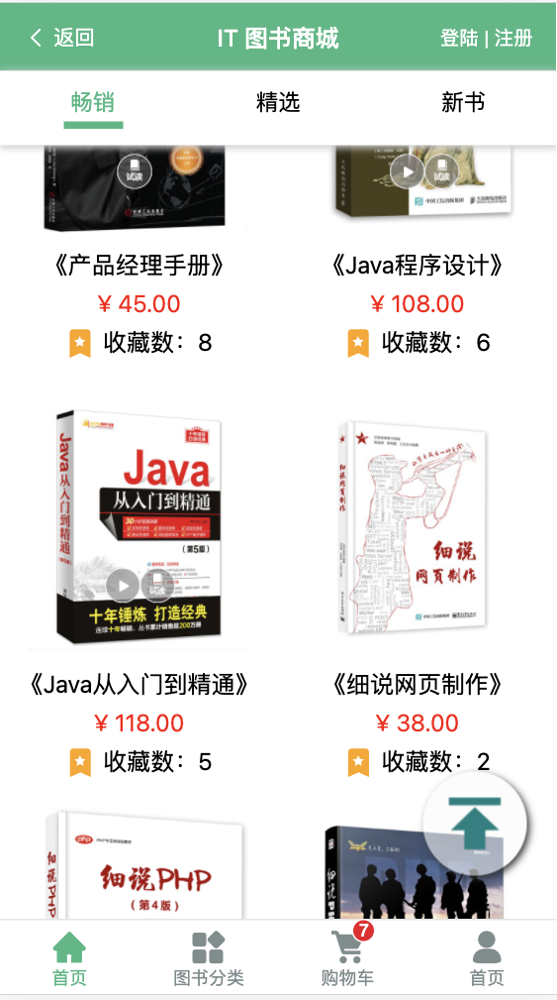
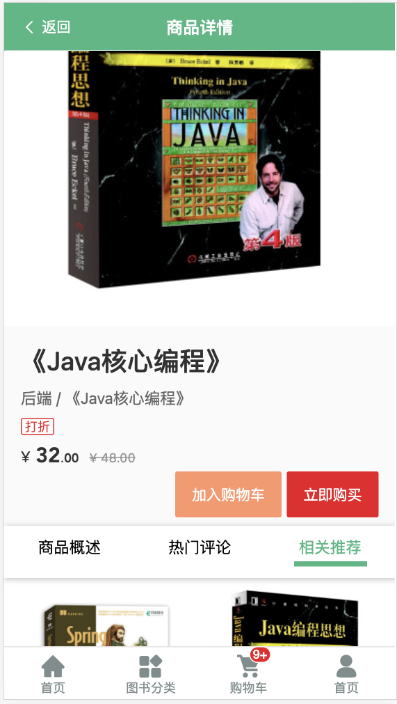
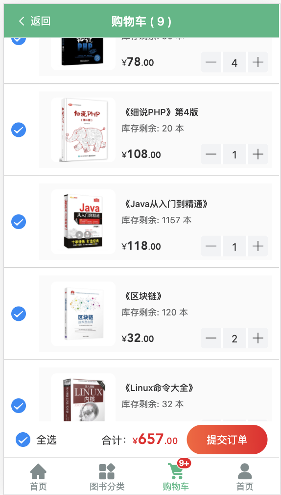
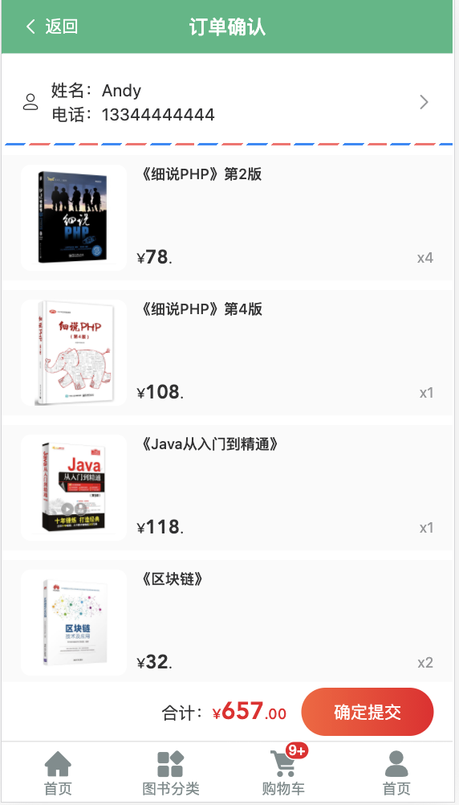
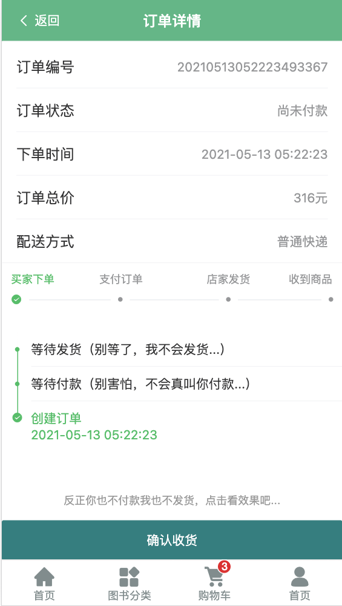
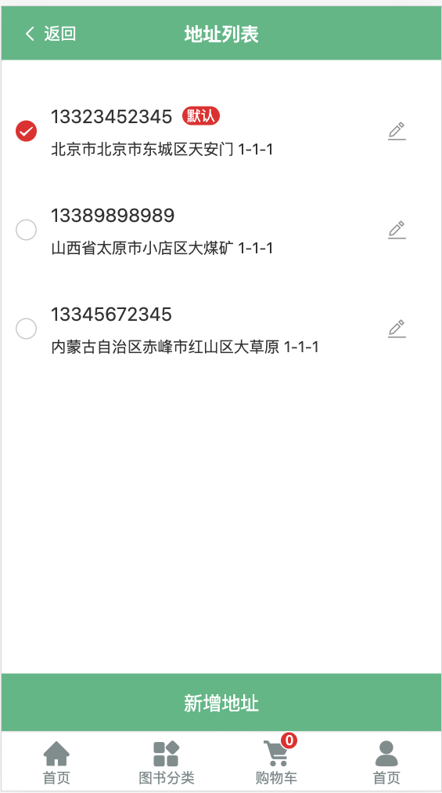
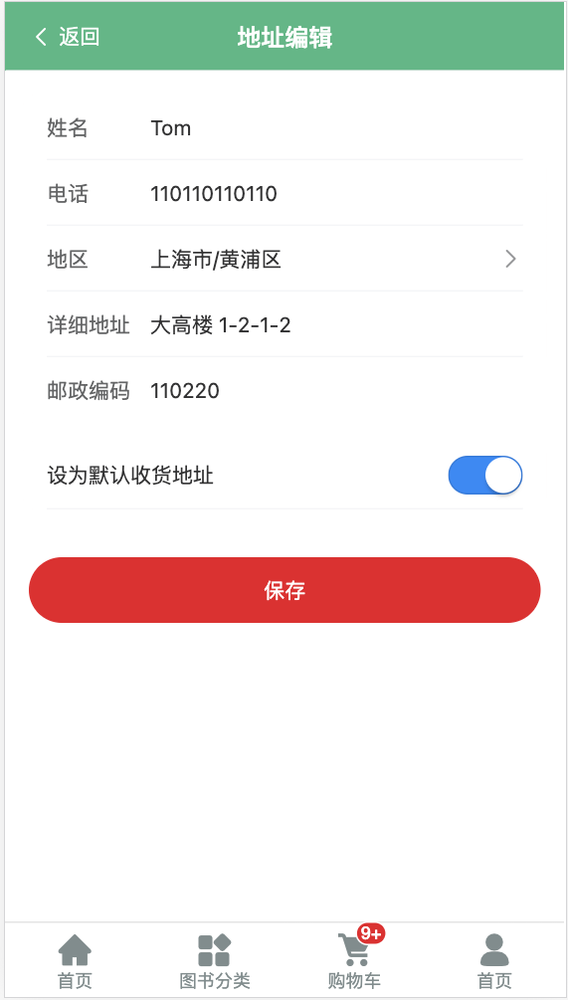

## vue-book-shop（SPA）
### IT图书商城手机端(单页面应用)

---

### Project setup
``` bash
npm install
```

### Compiles and hot-reloads for development
``` bash
npm run serve
```

### App running at
```
http://localhost:80880
```
Login
test测试账户：

userName：andy@qq.com

password：123456

---

### Home 主页



---

### Category 分类页


---

### Profile 个人主页


---

### Register 注册页


---

### Login 登陆页


**test测试用账户**:
- Email: andy@qq.com
- password: 123456

---

### Detail 商品详情页


---

### Cart 购物车


---

### Order 订单
### OrderList 订单列表页


---

### PayOrder 支付订单


---

### OrderDetail 订单详情


---

### Address 发货地址
### 1. Address List 地址列表


---

### 2. Add/Edit Address


---