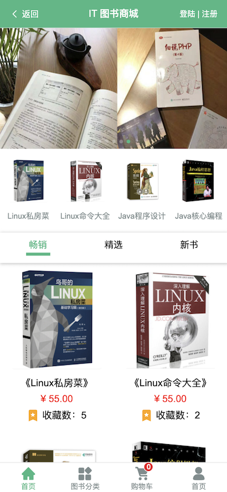
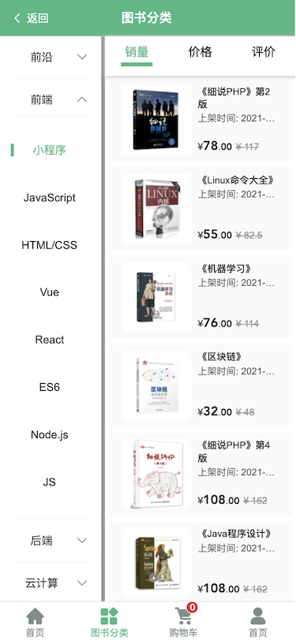
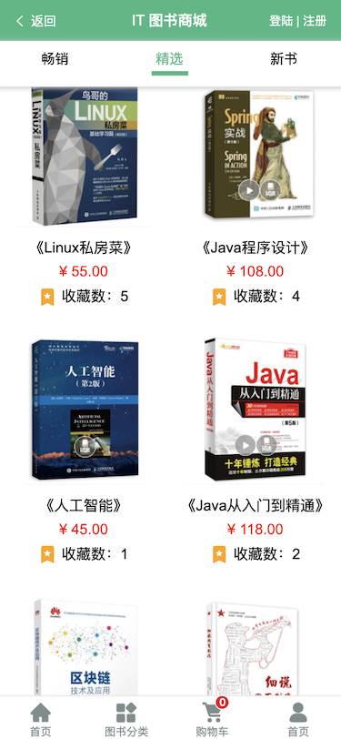
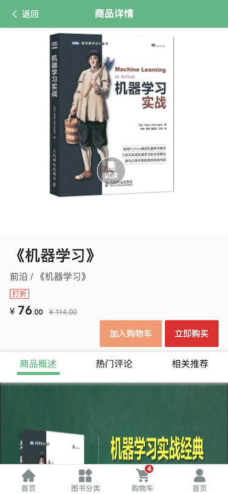
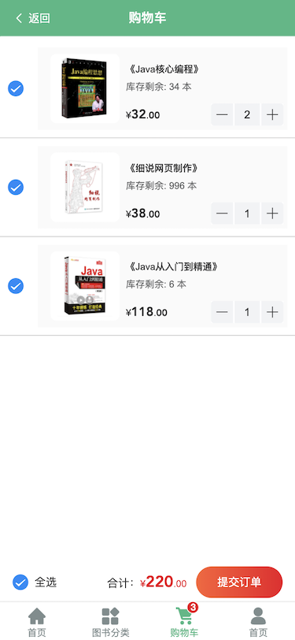
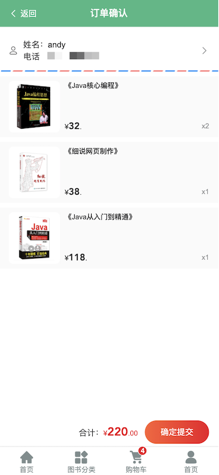
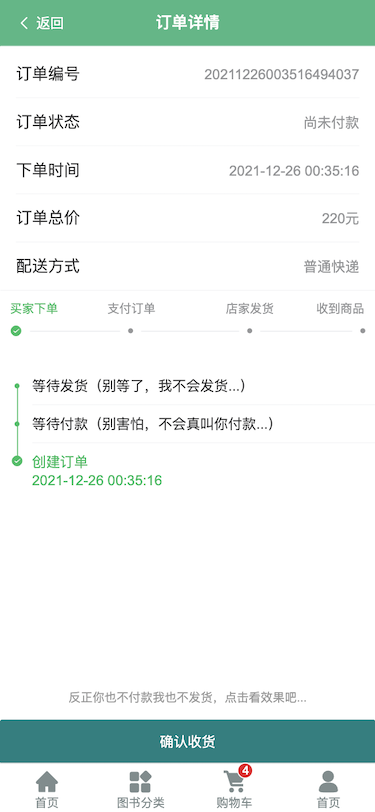
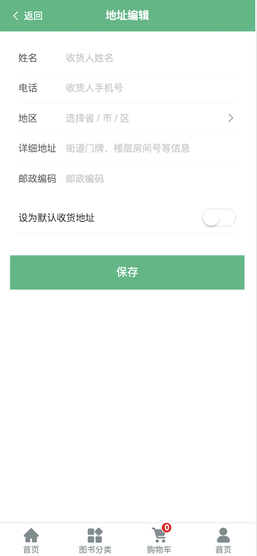
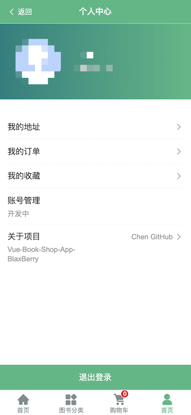

## Book-Shopping-Mobile

图书商城手机端(单页面应用)

> Login
> test 测试账户：
>
> userName：andy@qq.com
>
> password：123456

## Tech Stacks

- [Vue2]()

- [Vue-Router]()

- [Vant]()

- [Less]()

- [Axios]()

<b>Home 主页</b>

...

<b>Category 分类页</b>

...

<b>Profile 个人主页</b>

...

<b>Register 注册页</b>

...

<b>Login 登陆页</b>

**test 测试用账户**:

- Email: andy@qq.com
- password: 123456
  

## Routes

<b>Detail 商品详情页</b>

...

<b>Cart 购物车</b>

...

<b>OrderList 订单列表页</b>

...

<b>PayOrder 支付订单</b>

...

<b>OrderDetail 订单详情</b>

...

<b>Address List 地址列表</b>

...

<b>Add/Edit Address</b>

...

## Images

